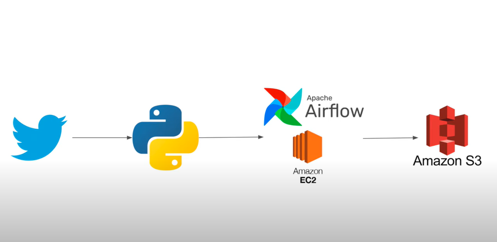

# Twitter-Data-Pipeline-Using-Airflow

## Overview
This data engineering project involves building an ETL (Extract, Transform, Load) data pipeline to extract, refine, and store Twitter data from any Twitter account. The pipeline is orchestrated using Apache Airflow, ensuring automated and scheduled execution. Leveraging Python and integrating Amazon S3 as a cloud-based storage solution, the project ensures scalable, secure, and highly available storage of processed tweet data for further analysis.

  ## Technology Stack
1. Python: The primary programming language used for data extraction, transformation, and pipeline orchestration.
2. Tweepy: A Python library for accessing the Twitter API and fetching tweet data.
3. Pandas: A popular Python library for data manipulation and analysis, used to store tweet data in a DataFrame.
4. Apache Airflow: An open-source platform for orchestrating complex data pipelines, defining workflows, and scheduling tasks.
5. Amazon S3: A cloud-based storage service provided by Amazon Web Services (AWS). Amazon S3 offers scalable, secure, and highly available data storage, making it an ideal solution for storing the processed tweet data in the cloud.

